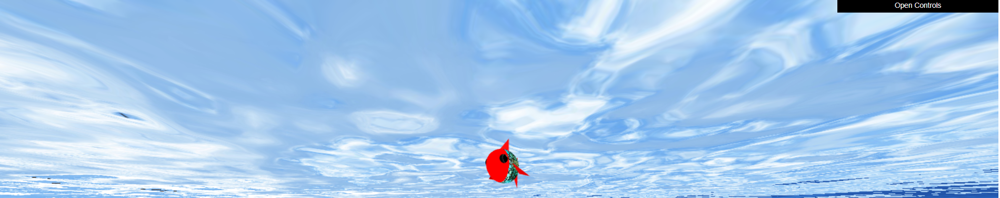

# CGRA 2020/2021

## Group T02G04

- Mariana Monteiro - up202003480
- Vasco Gomes - up201906617

## Project Notes

- As funcionalidades adicionais que implementamos foram:
  - 7.1 - Algas;
  - 7.4 - Lançamento das pedras para o alvo;
  - 7.5 - MyAnimatedFish - Animação de outros peixes.
- As maiores dificuldades sentidas ao longo da realização do projeto foram:
  - O fundo de areia com o ninho
  - As pedras

## Screenshots

### 1 - MyFish

### 2 - Sea Floor

### 3 - Superfície da água

### 4 - Pedras

### 5 - MyPillar

### 6 - Outros elementos

### 7 - Recolher Pedras

### 8 - Funcionalidades Adicionais

